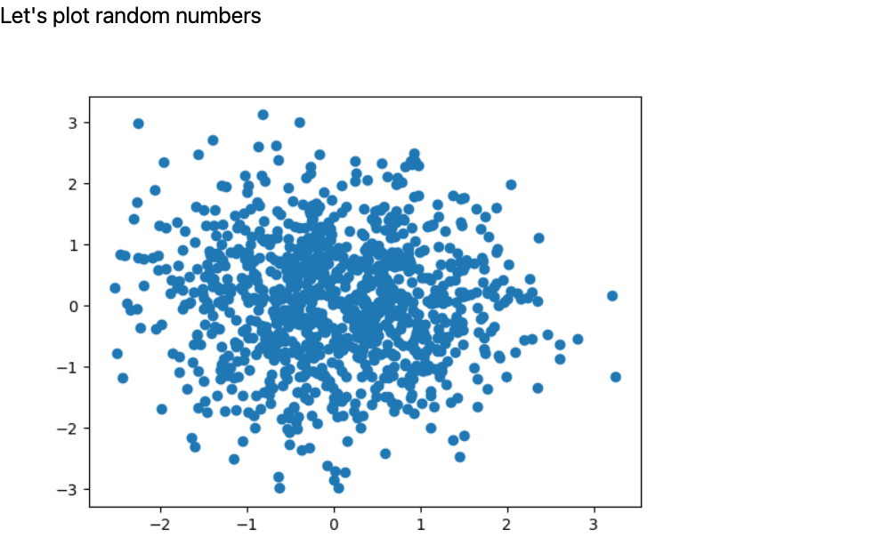

# pyscript-test
最近看到一個新的 Open source project 叫做 [PyScript](https://pyscript.net/)，是一個能在 HTML 中直接撰寫 Python 程式，當使用者開啟該檔案時，就會在背後直接開始執行 Python

感覺運用場景可以很廣，像是直接進行資料視覺化、產出 Dashboard 或是利用爬蟲直接顯示有興趣的網頁的結果

本 repo 主要是測試並記錄 PyScript 試用的過程與感想

---

## 不管怎樣都要先來個 Hello world


```html
<html>
  <head>
    <link rel="stylesheet" href="https://pyscript.net/alpha/pyscript.css" />
    <script defer src="https://pyscript.net/alpha/pyscript.js"></script>
  </head>
  <body> <py-script> print('Hello, World!') </py-script> </body>
</html>
```

- 開網頁直到顯示出 Hello World 之間，會有明顯有感的延遲時間

---

## 來點簡單的數學計算


```html
<html>

<head>
    <link rel="stylesheet" href="https://pyscript.net/alpha/pyscript.css" />
    <script defer src="https://pyscript.net/alpha/pyscript.js"></script>
</head>

<body>
    <py-script>
print("Let's compute π:")
def wallis(n):
    pi = 2
    for i in range(1, n):
        pi *= 4 * i ** 2 / (4 * i ** 2 - 1)
    return pi

pi = wallis(100000)
s = f"π is approximately {pi:.3f}"
print(s)
    </py-script>
</body>

</html>
```
- 看起來延遲時間是難以避免的了
- 發現沒辦法進行格式上的排版，若把 python 往後 indent，就會出現 error，對於我這種排版狂人看了是有點刺眼啊（笑

---

## 讓 Python 與 HTML Tags 溝通
- 利用 `pyscript.write()` 這個方法來將計算結果傳入指定的 `id`  tag 中


```html
<html>
    <head>
      <link rel="stylesheet" href="https://pyscript.net/alpha/pyscript.css" />
      <script defer src="https://pyscript.net/alpha/pyscript.js"></script>
      <link href="https://cdn.jsdelivr.net/npm/bootstrap@5.1.3/dist/css/bootstrap.min.css" rel="stylesheet" crossorigin="anonymous">
    </head>

  <body>
    <b><p>Today is <u><label id='today'></label></u></p></b>
    <br>
    <div id="pi" class="alert alert-primary"></div>
    <py-script>
import datetime as dt
pyscript.write('today', dt.date.today().strftime('%A %B %d, %Y'))

def wallis(n):
    pi = 2
    for i in range(1,n):
        pi *= 4 * i ** 2 / (4 * i ** 2 - 1)
    return pi

pi = wallis(100000)
pyscript.write('pi', f'π is approximately {pi:.3f}')
    </py-script>
  </body>
</html>
```

- 這部分終於開始有種「哦～好像有點實用！」的感覺出現了

---

## 試著呈現「視覺化圖表」



```html
<html>
    <head>
      <link rel="stylesheet" href="https://pyscript.net/alpha/pyscript.css" />
      <script defer src="https://pyscript.net/alpha/pyscript.js"></script>

      <py-env>
        - numpy
        - matplotlib
      </py-env>

    </head>

  <body>

    <h1>Let's plot random numbers</h1>
    <div id="plot"></div>
    <py-script output="plot">
import matplotlib.pyplot as plt
import numpy as np

x = np.random.randn(1000)
y = np.random.randn(1000)

fig, ax = plt.subplots()
ax.scatter(x, y)
fig
    </py-script>
  </body>
</html>
```
- 嗯...跑有點久
- 需要使用 `<py-env>` 來指名需要另外 import 進來的 Python Library (如上方程式碼)
- 另外也可以匯入 `.whl` 檔案，範例如下
    ```html
    <py-env>
    - './static/wheels/travertino-0.1.3-py3-none-any.whl'
    </py-env>
    ```
- 如果沒有你想要的，也可以去 [Pyodide](https://github.com/pyodide/pyodide) 提出 PR 或 issue ([pyodide packages 列表](https://github.com/pyodide/pyodide/tree/main/packages))

---

## 匯入自己定義的 py 檔


```html
<html>
    <head>
      <link rel="stylesheet" href="https://pyscript.net/alpha/pyscript.css" />
      <script defer src="https://pyscript.net/alpha/pyscript.js"></script>
      <py-env>
        - numpy
        - matplotlib
        - paths:
          - ./data.py
      </py-env>
    </head>

  <body>
    <h1>Let's plot random numbers</h1>
    <div id="plot"></div>
    <py-script output="plot">
import matplotlib.pyplot as plt
from data import make_x_and_y

x, y = make_x_and_y(n=1000)

fig, ax = plt.subplots()
ax.scatter(x, y)
fig
    </py-script>
  </body>
</html>
```

- 這個範例在自己本機上測試時會無法執行，因為在 web server 上會有找不到該檔案的問題
- 解決方法是
  1. 先使用 `python3 -m http.server`
  2. 前往 http://localhost:8000/
  3. 點選開啟 HTML 檔就可以看到順利執行的圖了
